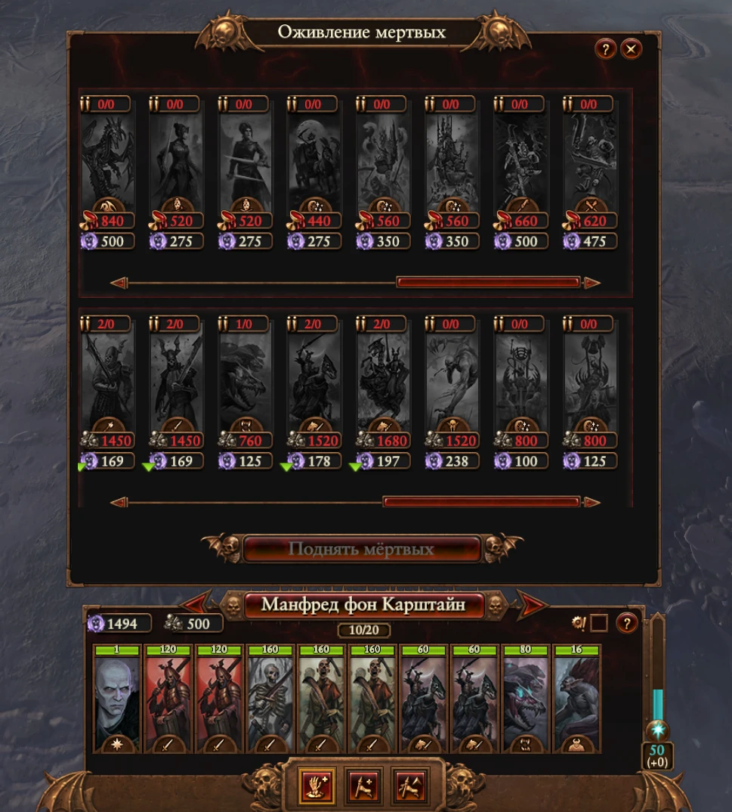
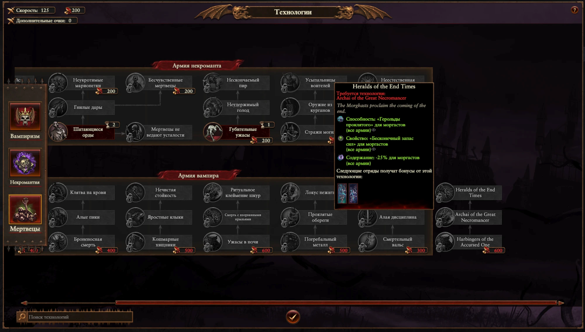
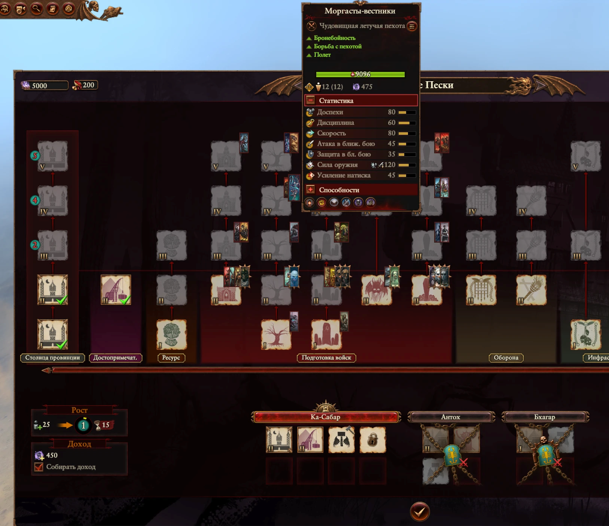

# Morghasts & Dread Abyssals for Vampire Counts

[**Steam Workshop page**](https://steamcommunity.com/sharedfiles/filedetails/?id=3814064730)

A Total War: Warhammer III mod that unlocks the Nagash DLC Morghasts and the
Dread Abyssal mounts for the Vampire Counts race, instead of keeping them
exclusive to the Nagash (Undead Legions) campaign.



**What it does:**

* **Morghast Harbingers** and **Morghast Archai**
  (`wh3_dlc29_vmp_mon_morghast_*`) become recruitable by every Vampire
  Counts faction
* Recruitment from the **Haunted Wood** building chain (where Vargheists and
  Terrorgheists live): Harbingers from tier 4, Archai from tier 5
* Recruitable through **Raise Dead** (gravecall) as elite units priced like
  Blood Knights: 620 blood for Harbingers, 660 for Archai
* Unit caps through the native VC **unit-allowance** system — the same
  owned-across-all-armies "x/y" limit every other Vampire Counts unit has:
  * Haunted Wood T4: 1 Harbinger
  * Haunted Wood T5: 2 Harbingers + 1 Archai (multiple provinces stack)
* **A new 3-tech branch** in the VC military tech tree (right of the Vampire
  Army box, priced like the Terrorgheist branch) that ports the Morghast
  buffs from Nagash's Black Pyramid — everything except the gravecall
  unlocks:
  * *Harbingers of the Accursed One*: +1 Harbinger cap; Harbingers get
    melee defence +7, bonus vs infantry +8, weapon strength +15%,
    ward save +15%, speed +15%, Vanguard Deployment
  * *Archai of the Great Necromancer*: +1 Archai cap; Archai get
    armour +25, bonus vs large +8, weapon strength +15%, leadership +15,
    melee attack +10, ward save +10%
  * *Heralds of the End Times*: Perfect Vigour, the Heralds of the
    Accursed One ability, upkeep −25% for all Morghasts
* Morghasts are added to the buff lists of the VC roster skills:
  * *Raising the Dead* (Black Knights / Blood Knights / Drakenhof Templars
    red-line skill)
  * the flying-monsters red-line skill (Fell Bats / Vargheists /
    Terrorgheists / Zombie Dragons, rank 7+)
* **Ashigaroth, Devourer of the Craven** for Mannfred and the Dread Abyssal
  mount for Neferata: the mount skill nodes already exist in their skill
  trees but are gated to the Nagash campaign subculture — the gate is
  removed, so the mounts are available in every campaign (vanilla level
  requirement kept)

**Vampire Coast** gets the same two units, kept deliberately simple:

* Recruitable from the two tier-5 buildings that recruit the Coast
  Terrorgheist: the ship's *Crow's Nest* and the settlement *Giant Feeding
  Cave*; ordinary recruitment, no unit caps. Recruitment takes 3 turns like
  the Coast Terrorgheist: the units' own value is 1 turn, so a hidden
  faction effect bundle (+2 turns for Morghasts, `recruit_time_mod` on the
  per-unit sets) is applied by script to every Vampire Coast faction, AI
  included
* Added to the unit sets of the Coast lord skills *Haunting Horror* (melee
  attack / charge bonus lines; the missile-damage line stays Deck Droppers
  only) and *Masterly Splicing* (leadership / speed / melee defence, rank 7+)
* Aranessa's Sartosa military group included; no tech branch, no Raise Dead
  entries for the Coast




Hire costs, upkeep and unit stats are untouched. Works in Immortal Empires
and all campaigns. The Nagash campaign is unaffected by construction: the
allowance rows are scoped to the `vampire_counts` faction set, which his
faction is not part of.

Save-game compatible: add at any time. Removing mid-campaign is safe too —
already-recruited Morghasts just become over-cap.

## How it works

No Assembly Kit, no RPFM — the mod is generated from the game's own db by a
PowerShell toolchain (see [tools/](tools/)):

| Table | Rows | Purpose |
|---|---|---|
| `units_to_groupings_military_permissions` | 6 | allow the units for the Vampire Counts military group and the two Vampire Coast groups (main + Sartosa) |
| `building_units_allowed` | 7 | recruitment from Haunted Wood 4/5 (VC) and Crow's Nest / Giant Feeding Cave tier 5 (Coast) |
| `character_skill_nodes` | 2 (override) | clear the `wh3_dlc29_sc_nag_undead_legions` subculture gate on the two mount skill nodes |
| `unit_set_to_unit_junctions` | 9 | add Morghasts to the VC knight / flying-monster skill unit sets and the Coast Haunting Horror / Masterly Splicing sets |
| `effects` | 3 | cap-carrier effects (cloned from the TK Morghast cap effects) + the Coast recruitment-duration effect (cloned from the Depth Guard faction-trait effect) |
| `effect_bonus_value_ids_unit_sets`, `effect_bundles`, `effect_bundles_to_effects_junctions` | 2 + 1 + 1 | `recruit_time_mod` +2 on the two Morghast unit sets, wrapped in a faction bundle the script applies to Vampire Coast factions |
| `unit_lists`, `unit_to_unit_list_junctions` | 2 + 2 | dedicated cap lists (`vc_morghasts_cap_*`), CA's own `wh3_unit_cap_*` pattern |
| `unit_allowances` | 2 | the allowance definitions for the `vampire_counts` faction set |
| `effect_bonus_value_unit_list_junctions` | 2 | bind `unit_allowance_point_cap_mod` to the lists through the effects |
| `building_effects_junction` | 3 | caps from Haunted Wood 4/5 |
| `technology_effects_junction` | 17 | the three techs' effects (+ the +1/+1 caps) |
| `technologies`, `technology_nodes`, `technology_node_links`, `technology_ui_tabs_…` | 3 + 3 + 2 + 3 | the tech branch |
| `mercenary_unit_groups`, `mercenary_pool_to_groups_junctions` | 2 + 2 | Raise Dead pool entries (`wh3_dlc29_vmp_raise_dead_faction`) |
| `unit_recruitment_source_overrides`, `resource_costs`, `resource_cost_pooled_resource_junctions` | 2 + 2 + 2 | blood price for the pool |
| `text/db/*.loc` | 13 | English tooltips for the cap effects and the techs |
| `script/campaign/mod/vc_morghasts.lua` | — | registers the pool entries in campaigns created before the mod was added, and tops up pool stock every turn |

The binary table layouts were reverse-engineered by brute-forcing token
grammars against the live db with exact-EOF validation, then cross-checked
against the RPFM schema; a few hard-won findings (all documented in the
build script):

* `effect_bonus_value_unit_list_junctions` is `[bonus_value_id][unit_list][effect]`
  — a periodic stream round-trips under the wrong column order too, and the
  game then reads the list key as a bonus id ("invalid database record")
* `mercenary_unit_groups` must be written with the exact vanilla byte tail;
  the schema-derived layout passes the db validator but the game silently
  never creates the pool entries
* `technology_ui_groups` + its node junction (a custom box in the tech
  tree) corrupted memory at campaign start — the branch therefore renders
  ungrouped, next to the Vampire Army box

## Build from source

```bash
powershell -File tools/build_vc_morghasts.ps1
```

Requires the game installed (tables are read from `data/db.pack`) and any
`libzstd.dll` (the one shipped with Git for Windows works).

## Known quirks

* The cap-effect tooltip line ("Unit capacity: +N") and the tech names are
  English-only — mod `.loc` files apply to all game languages.
* In campaigns started before the mod was installed, the Raise Dead entries
  are created by script with a pool stock of 19 per unit (filled on load and
  one unit put back after every hire, so batches of up to 19 and unlimited
  sequential hiring). Campaigns created with the mod installed get unlimited
  stock — the allowance cap is the only limit.

## Disclaimer

Not affiliated with Creative Assembly or Games Workshop. Single-player
convenience mod; unbalancing by design.

## See also

[Unlimited Mercenaries](https://github.com/okolovmark/unlimited-mercenaries) —
the sibling mod built with the same toolchain.

## Publishing to the Steam Workshop

The pack is uploaded with Runcher's `workshopper.exe` (tags must be passed as
separate arguments: `--tags mod --tags campaign`). The classic CA launcher
lists only Workshop items that carry the key-value tags `PACK_NAME` and
`game_version` (the launcher's own uploader sets them; workshopper does not),
so after the first upload run once:

```bash
powershell -File tools/workshop_set_launcher_tags.ps1 -Id 3814064730 -PackName vc_morghasts.pack
```

It talks to the running Steam client through the game's `steam_api64.dll`
and only adds the two tags (no content re-upload). `tools/workshop_query.ps1`
dumps the full UGC details of any items, including those tags, for checking.
